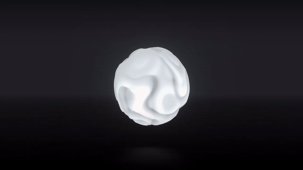

# Orion

https://pierrekeda.com/projects/orion  

*"In a sky of iron the points of the Dipper hung like icicles and Orion flashed his cold fires."  \-Edith Wharton*

## Credits

Collaborative work with Thibaut Foussard.  

Original shader and concept:  
https://projects.thibautfoussard.com/plasma  

Find Thibaut at:  
https://www.thibautfoussard.com  
https://www.npmjs.com/~thibka

_

Made with:  
[three.js](https://github.com/mrdoob/three.js) - 
[lil-gui](https://lil-gui.georgealways.com) - 
[vesuna](https://github.com/pierrekeda/vesuna)

Original reflective floor by Patrick Schroen:  
https://alien.js.org/examples/shader_reflection.html  
https://github.com/pschroen/alien.js  

***
*Pierre Keda - 2021*
