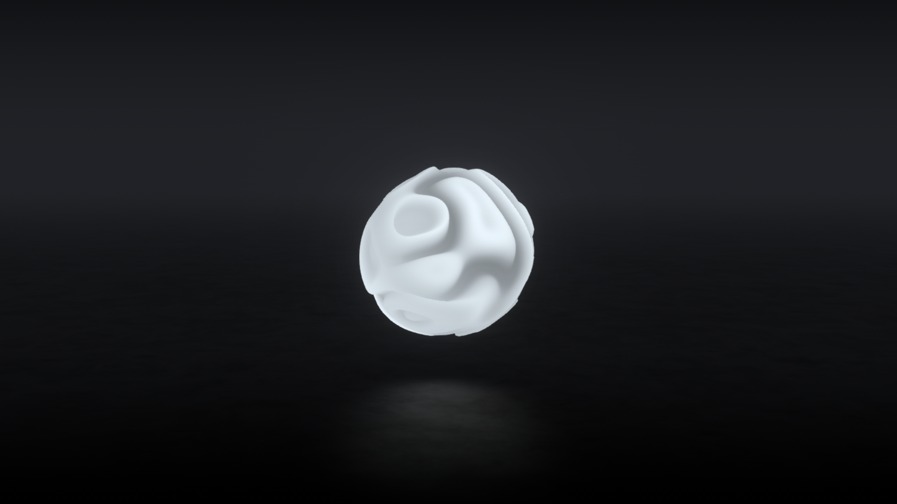

# Orion

https://pierrekeda.github.io/orion/  

*"In a sky of iron the points of the Dipper hung like icicles and Orion flashed his cold fires."  \-Edith Wharton*

## Credits

Collaborative work with Thibaut Foussard.  

Original shader and concept:  
https://projects.thibautfoussard.com/plasma/  

Find Thibaut at:  
https://www.thibautfoussard.com/  
https://www.npmjs.com/~thibka  
https://codepen.io/Thibka  

_

Made with 
[three.js](https://github.com/mrdoob/three.js) & 
[dat.gui](https://github.com/dataarts/dat.gui).

Original reflective floor by Patrick Schroen:  
https://alien.js.org/examples/shader_reflection.html  
https://github.com/pschroen/alien.js  

***
*Pierre Keda - 2021*
